# How to apply textures to a 3D model

1. Firstly get your files together!  
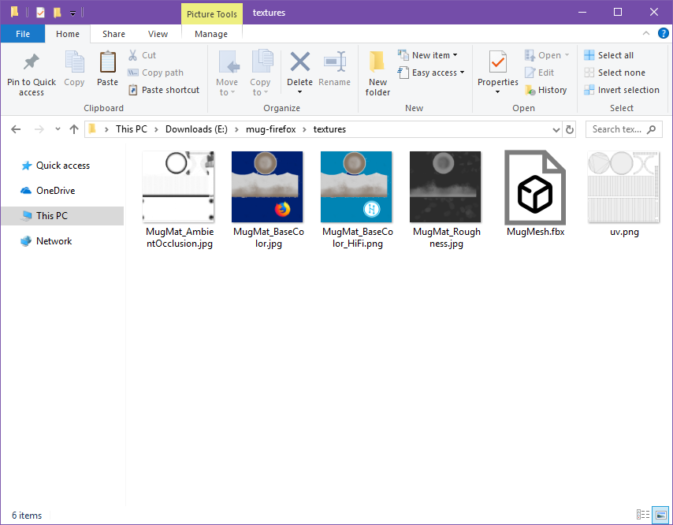  
2. Next in blender, you will want to import your model! I will be using a mug for this.  
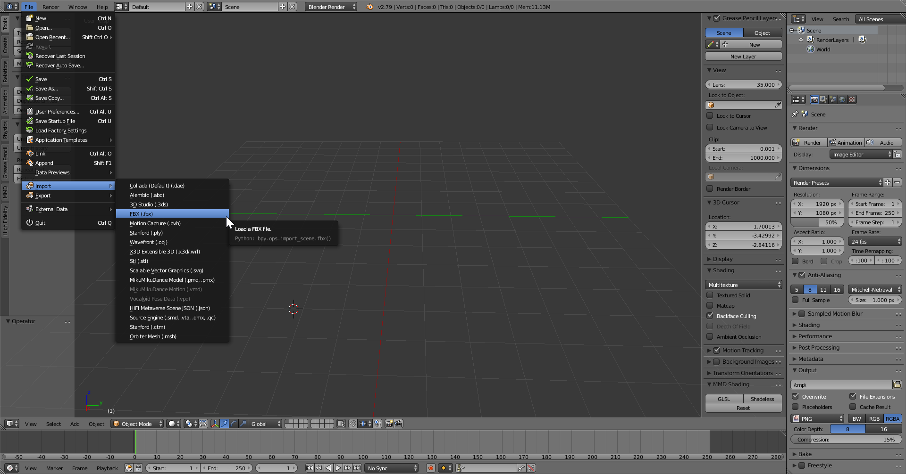  
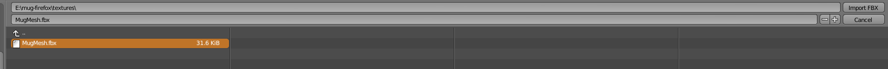  
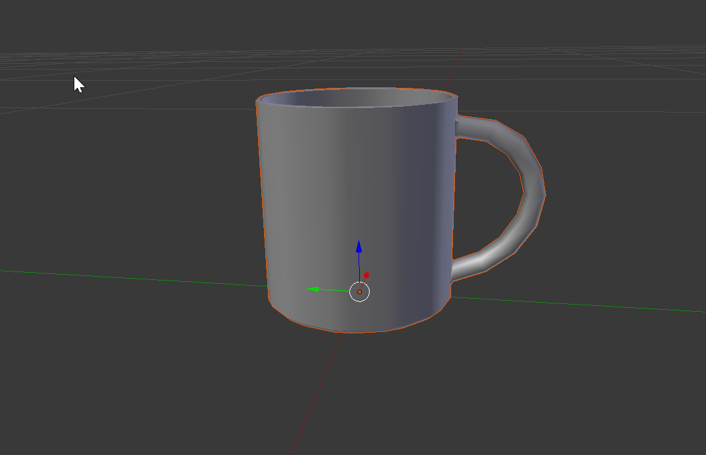  
3. Now right click on the model to make sure it is selected. Now goto the right hand panel and click on the Material tab.  
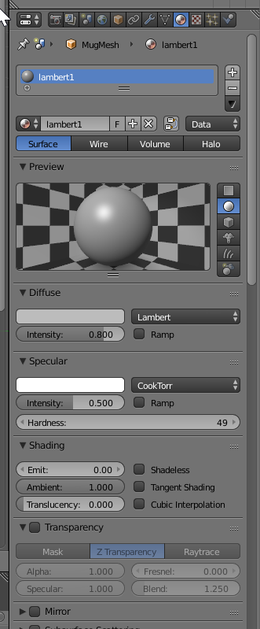  
4. You will want to make sure you set the diffuse colours to white!  
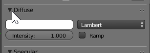  
5. Click on the Texture tab next.  
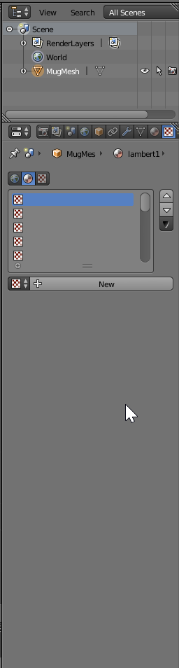  
6. Click on the "New" button to add a default texture  
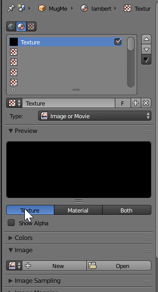  
7. Now you will want to click on open and choose your texture file.  
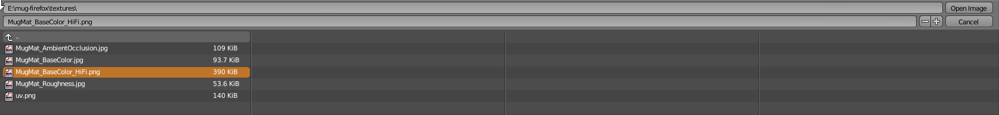  
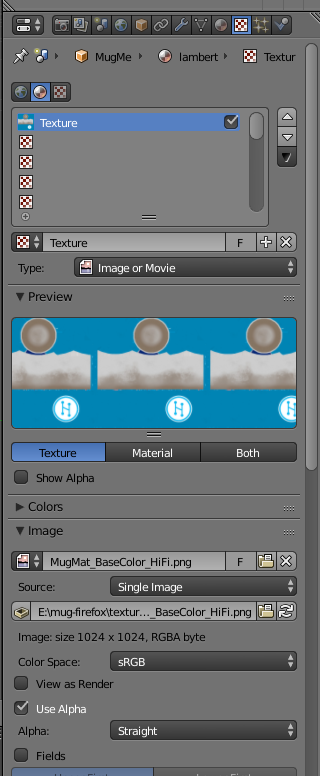  
8. Make sure you embed your texture by clicking on this box!  
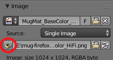  
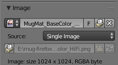  
9. Now you can go back to the 3D panel and add a hemi lamp  
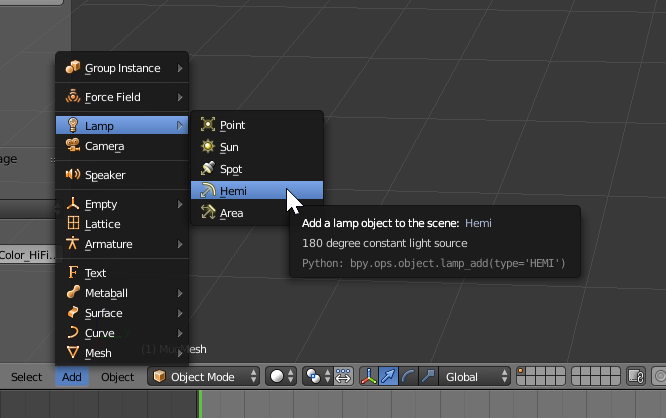  
10. Switch viewport shadowing to material so you can see your materials.  
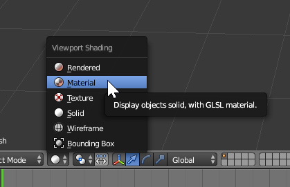  
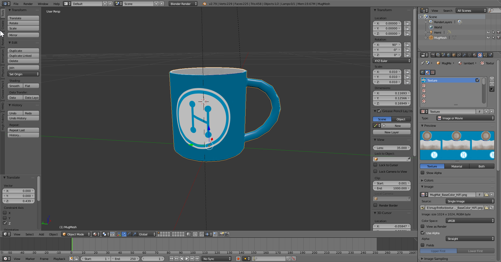  
11. Now to export!
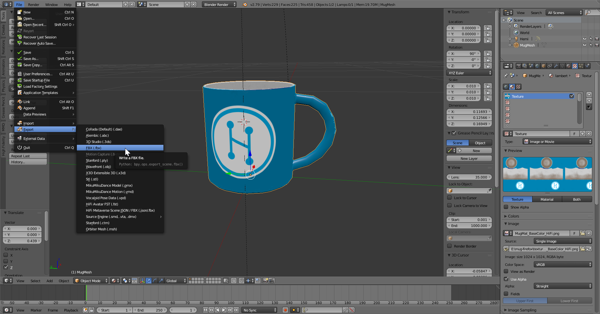  
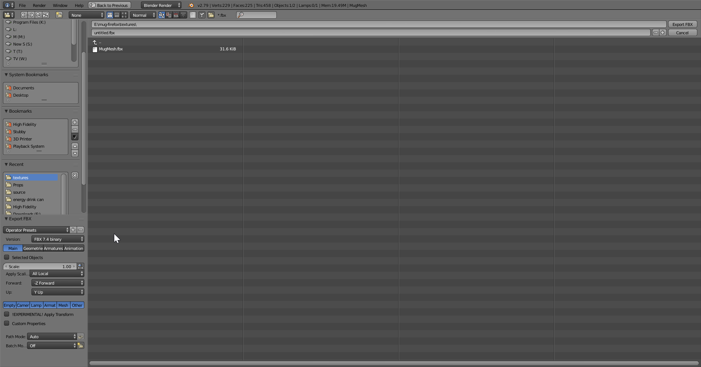
12. You will want to make sure in the left hand panel that your settings have been changed!  
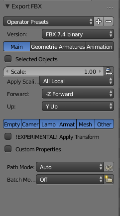
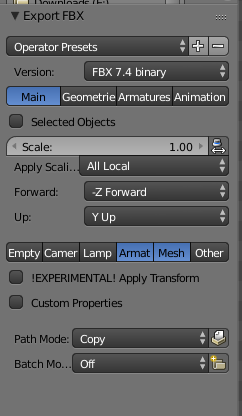  
13. Upload to your service of your choice and rez it inworld!  
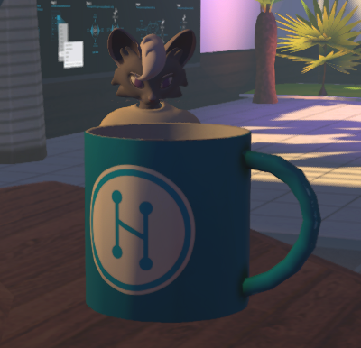  